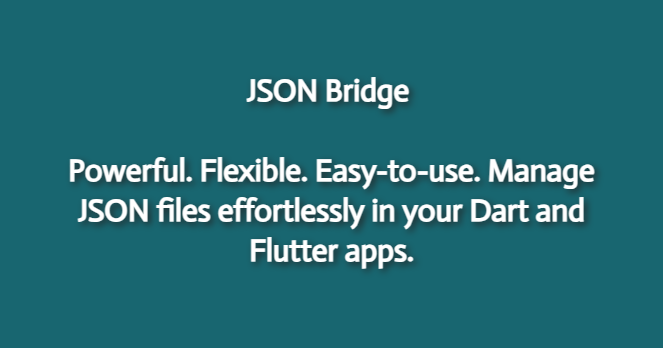

# JSON Bridge for Dart and Flutter



[](https://github.com/dahkenangnon/json_bridge.dart)
[](https://pub.dev/packages/json_bridge)
[](https://github.com/dahkenangnon/json_bridge.dart)


**Powerful. Flexible. Easy-to-use. Manage JSON files effortlessly in your Dart and Flutter apps.**

---


## Compatibility and Platform Support

Compatible with:

- Dart SDK: >=2.14.0 <3.0.0
- Flutter: >=2.10.0

Platform support:

| Platform  | Support |
|-----------|---------|
| Android   | ✔️      |
| iOS       | ✔️      |
| Linux     | ✔️      |
| macOS     | ✔️      |
| Windows   | ✔️      |

---

## Why Choose JSON Bridge?

> :rocket: Supercharge your Dart and Flutter apps with JSON Bridge – the ultimate solution for managing JSON files with ease.
>
> :sparkles: Store and retrieve data effortlessly from a JSON file.
>
> :open_file_folder: Seamlessly manage JSON files in the application document directory or a custom directory.
>
> :mag_right: Manipulate nested keys using the dot notation with **JSONBridge**.
>
> :gear: Use **JSONBridge** to store user preferences, settings, data, and more.
>
> :fire: Build powerful NoSQL databases for Dart and Flutter apps with **JSONBridge**.
> 
> :floppy_disk: Store any data in a JSON file within your application.
>
> :wave: Engage users by customizing the app experience based on their preferences stored with **JSONBridge**.
>
> :hourglass_flowing_sand: Track user activity and restore the last seen screen when the app restarts.
>
> :bulb: The possibilities are endless – let your imagination run wild!

---

## Getting Started

### 1. Add the JSON Bridge dependency to your `pubspec.yaml` file:

```yaml
dependencies:
  # Replace [latest_version] with the latest version of JSON Bridge.
  json_bridge: ^latest_version
```

### 2. Import the package in your Dart or Flutter code:

```dart
import 'package:json_bridge/json_bridge.dart';
```

### 3. Initialize the package:

```dart
// Omit `dir` to use the default Flutter application document directory (no permission required).
// If you specify a `dir`, make sure to set the necessary permissions as you will be accessing an external directory.
// For more information, see: https://developer.android.com/training/data-storage/app-specific#external
JSONBridge jsonBridge = JSONBridge()..init(fileName: 'config', dir: 'test');
```

### 4. Start using JSON Bridge:

#### 4.1. Write data to the JSON file:

Note that using the `write` method will overwrite the entire file. If you want to add a key/value pair or a new JSON object, consider using the `set` method.

```dart
jsonBridge.write({
  'name': 'John Doe',
  'age': 25,
  'address': {
    'street': 'Main Street',
    'city':

 'New York',
    'country': 'USA'
  }
});
```

#### 4.2. Clear the JSON file and delete it:

```dart
jsonBridge.clear();
```

#### 4.3. Read the entire content of the JSON file:

```dart
Map<String, dynamic> dataFromJsonBridge = jsonBridge.read();
```

Your `dataFromJsonBridge` variable will contain the entire content of the JSON file as a `Map<String, dynamic>`.

#### 4.4. Add a new JSON object:

```dart
jsonBridge.set('preferences', {
  'dark': true,
  'receive_notification': false,
  'show_update_notification': true,
});
```

#### 4.5. Update a nested key/value pair:

Let's say we want to update the dark mode preference to `false`:

```dart
jsonBridge.set('preferences.dark', false);
```

#### 4.6. Get a value:

Use dot notation to access nested keys. If a key is not found, the method will return `null`. If a key contains invalid characters, an error will be thrown.

```dart
String name = jsonBridge.get('name'); // 'John Doe'

int age = jsonBridge.get('age'); // 25

String street = jsonBridge.get('address.street'); // 'Main Street'

String city = jsonBridge.get('address.city'); // 'New York'

String country = jsonBridge.get('address.country'); // 'USA'

bool dark = jsonBridge.get('preferences.dark'); // false

bool receiveNotification = jsonBridge.get('preferences.receive_notification'); // false

bool showUpdateNotification = jsonBridge.get('preferences.show_update_notification'); // true
```

#### 4.7. Delete a key:

```dart
jsonBridge.delete('preferences.show_update_notification');
```

#### 4.8. Check if a key exists:

```dart
bool exists = jsonBridge.exists('preferences.dark'); // true

bool exists = jsonBridge.exists('iKnowThisKeyDoesNotExist'); // false
```

---

## API Reference

The following table lists all the available methods in **JSONBridge**. Use dot notation for accessing nested keys.

| Method                  | Description                                |
|-------------------------|--------------------------------------------|
| `void init({required String fileName, String? dir})`  | Initialize the bridge by creating the JSON file. This method should be called before any other methods. |
| `Map<String, dynamic> read()`  | Read the JSON file and return its contents as a `Map`. |
| `void write(Map<String, dynamic> data)`  | Write a `Map` into the JSON file, overwriting the existing content. |
| `void clear()`  | Delete the JSON file and its contents. |
| `void set(String key, dynamic value)`  | Add or update a key in the JSON file. |
| `void delete(String key)`  | Delete a key from the JSON file. |
| `dynamic get(String key)`  | Get the value associated with a key from the JSON file. |
| `bool has(String key)`  | Check if a key exists in the JSON file. |

---

## Support and Contributions

Have questions or need support? Email us at **dah.kenangnon@gmail.com**. We're here to help!

Contributions are welcome and greatly appreciated. Help us make JSON Bridge even better by following our [contribution guidelines](CONTRIBUTING.md) and [code of conduct](CODE_OF_CONDUCT.md).

Join the JSON Bridge community now and experience the power of easy JSON file management in your Dart and Flutter projects!

## License

This project is licensed under the BSD-3-Clause License. See the

 [LICENSE](LICENSE) file for details.

[](https://github.com/dahkenangnon/json_bridge.dart)
